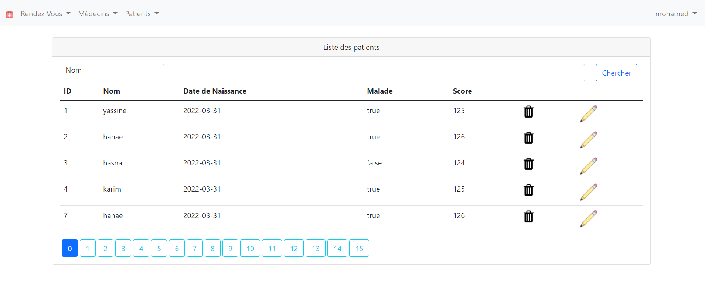
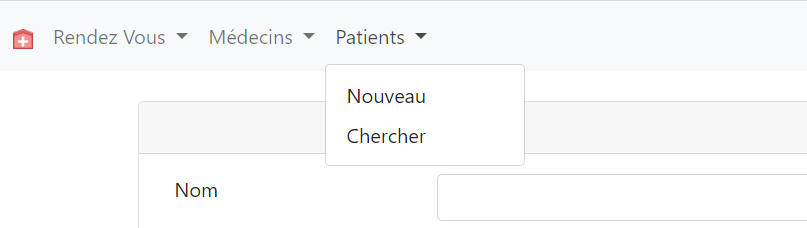
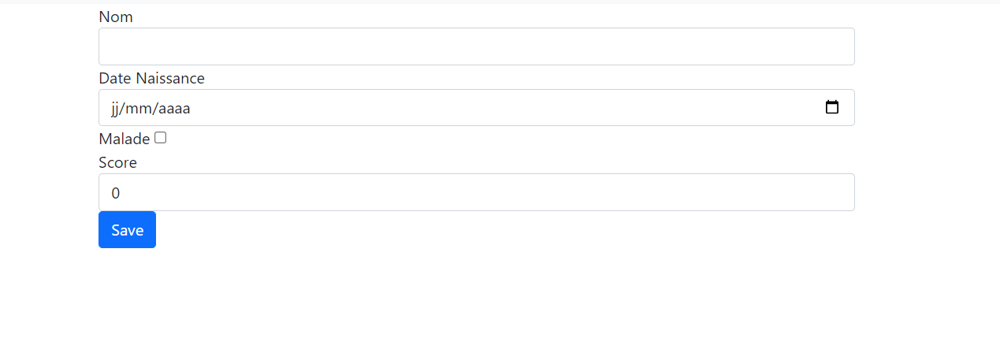
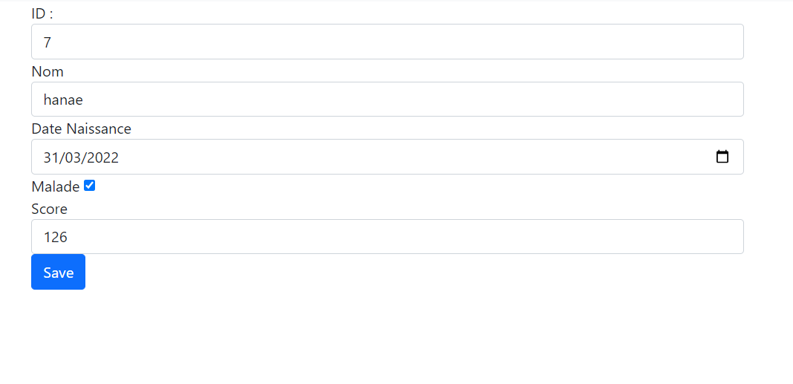
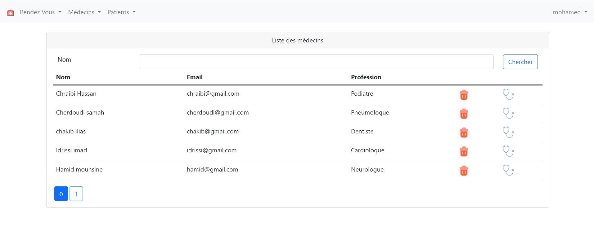
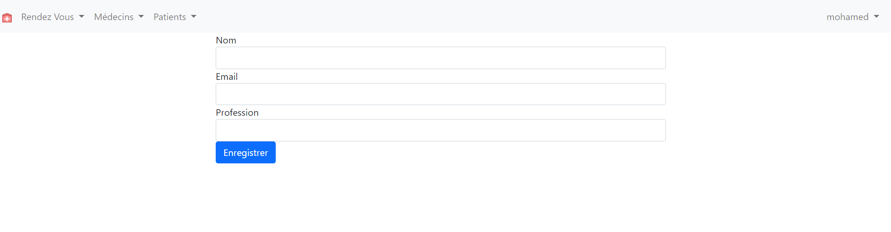

<h2 align="center"  style="color: red" >Compte Rendu</h4>
<h3>Application Web pour la gestion des patients dans un hopital à l'aide du  
Spring Boot Spring MVC Thymeleaf Spring Securiry  </h3>

<ul>
    <li style="color: blue"><strong>ADMINISTRATEUR</strong>
        

        <ol> </ol>
        <ol style="text-align: center"><strong style="color: red">Figure 1: </strong> La liste des Patients</ol>
        <ol> </ol>
        <ol style="text-align: center"><strong style="color: red">Figure 2: </strong>Ajouter un Patient</ol>
        <ol> </ol>
        <ol style="text-align: center"><strong style="color: red">Figure 3: </strong>Formulaire d'ajout d'un Patient</ol>
        <ol> </ol>
        <ol style="text-align: center"><strong style="color: red">Figure 4: </strong>Formulaire de modification</ol>
        <ol> </ol>
        <ol style="text-align: center"><strong style="color: red">Figure 5: </strong>Liste des Médecins Disponibles</ol>
        <ol> </ol> 
        <ol style="text-align: center"><strong style="color: red">Figure 5: </strong>Formulaire D'ajout d'un nouveau Médecin</ol>
</li>
    <li style="color: blue"><strong>UTILISATEUR</strong>
    </ol>
    <ol style="text-align: center"><strong style="color: red">Figure 1: </strong> La liste des Patients</ol>
    <ol> </ol>
    <ol style="text-align: center"><strong style="color: red">Figure 5: </strong>Liste des Médecins Disponibles</ol>
    </li>
</ul>